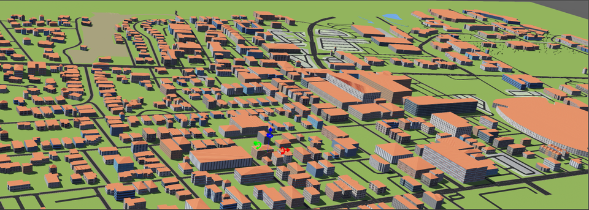

# cs460project2
Project 2 - Outdoor Simulated Environment in Webots

## The University of Alabama - Main Campus

# Requirements
-0.5 sq mile total area\
-1.5 miles of streets\
-0.5 miles of sidewalks\
-Appropriate lighting that can be changed to model two times of day

# TO RUN THE PACKAGE
Check the README.md file in webots_ros2_project2_python\
If it is too laggy to explore the map in Webots, the obj file is included in the /worlds/objects/ folder
