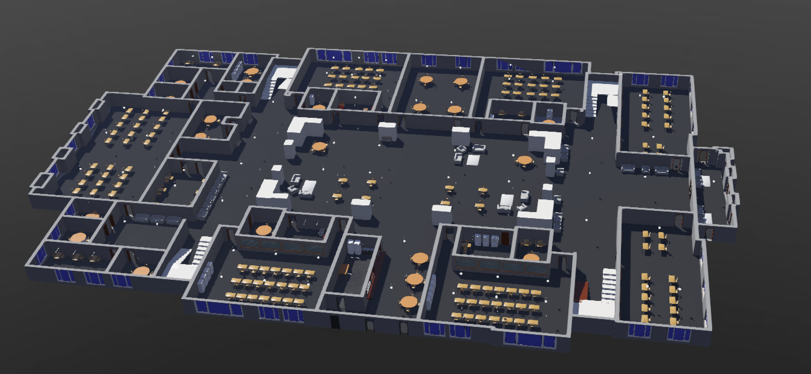

# cs460project1
Project 1 - Indoor Simulated Environment in Webots

# Hewson Hall First Floor
## The University of Alabama - Main Campus
-29,690 sf\
-9 classrooms\
-14 team rooms\
-Cafe\
-I.T. suite

# Requirements
Mapped 29,690 sf (First floor)\
Furnished entire map\
Added lighting

# What has not yet been completed
Added toggle for lighting and doors

# TO RUN THE PACKAGE
Check the README.md file in webots_ros2_project1_python
